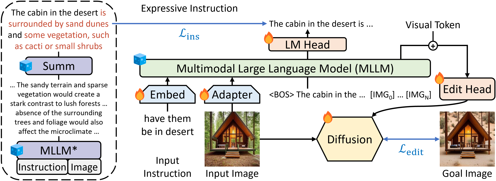
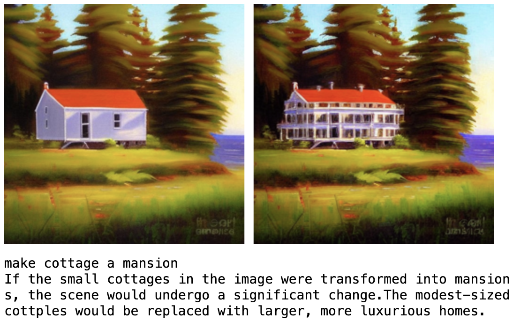

# Guiding Instruction-based Image Editing via Multimodal Large Language Models
This repo contains the code for [Guiding Instruction-based Image Editing via Multimodal Large Language Models](https://arxiv.org/abs/2309.17102) (ICLR'24 Spotlight)

## Overview
MGIE is an implementation of <br>
"[Guiding Instruction-based Image Editing via Multimodal Large Language Models](https://arxiv.org/abs/2309.17102)" <br>
[Tsu-Jui Fu](https://scholar.google.com/citations?user=7QRDcC0AAAAJ), [Wenze Hu](https://scholar.google.com/citations?user=0YPYs5UAAAAJ), [Xianzhi Du](https://scholar.google.com/citations?user=l1hP40AAAAAJ), [William Yang Wang](https://scholar.google.com/citations?user=gf8Ms_8AAAAJ), [Yinfei Yang](https://scholar.google.com/citations?user=kvDbu90AAAAJ), and [Zhe Gan](https://scholar.google.com/citations?user=E64XWyMAAAAJ) <br>
in International Conference on Learning Representations (**ICLR**) 2024



Instruction-based image editing improves the controllability and flexibility of image manipulation via natural commands without elaborate descriptions or regional masks. However, human instructions are sometimes too brief for current methods to capture and follow. Multimodal large language models (MLLMs) show promising capabilities in cross-modal understanding and visual-aware response generation via LMs. We investigate **how MLLMs facilitate edit instructions** and present MLLM-Guided Image Editing (MGIE). MGIE learns to **derive expressive instructions** and provides explicit guidance. The editing model **jointly captures this visual imagination and performs manipulation** through end-to-end training.

## Requirements
```
conda create -n mgie python=3.10 -y
conda activate mgie
conda update -n base -c defaults conda setuptools -y
conda install -c conda-forge git git-lfs ffmpeg vim htop ninja gpustat -y
conda clean -a -y

pip install -U pip cmake cython==0.29.36 pydantic==1.10 numpy
pip install -U gdown pydrive2 wget jupyter jupyterlab jupyterthemes ipython
pip install -U sentencepiece transformers diffusers tokenizers datasets gradio==3.37 accelerate evaluate git+https://github.com/openai/CLIP.git
pip install -U https://download.pytorch.org/whl/cu113/torch-1.12.0%2Bcu113-cp310-cp310-linux_x86_64.whl https://download.pytorch.org/whl/cu113/torchvision-0.13.0%2Bcu113-cp310-cp310-linux_x86_64.whl https://download.pytorch.org/whl/cu113/torchaudio-0.12.0%2Bcu113-cp310-cp310-linux_x86_64.whl
pip install -U deepspeed

# git clone this repo
cd ml-mgie
git submodule update --init --recursive
cd LLaVA
pip install -e .
pip install -U https://download.pytorch.org/whl/cu113/torch-1.12.0%2Bcu113-cp310-cp310-linux_x86_64.whl https://download.pytorch.org/whl/cu113/torchvision-0.13.0%2Bcu113-cp310-cp310-linux_x86_64.whl https://download.pytorch.org/whl/cu113/torchaudio-0.12.0%2Bcu113-cp310-cp310-linux_x86_64.whl
pip install -U ninja flash-attn==1.0.2
pip install -U pydrive2 gdown wget

cd ..
cp mgie_llava.py LLaVA/llava/model/llava.py
cp mgie_train.py LLaVA/llava/train/train.py
```

## Quick Start
Put official [LLaVA-7B](https://huggingface.co/liuhaotian/LLaVA-Lightning-7B-delta-v1-1) in [_ckpt/LLaVA-7B-v1](_ckpt) and download pre-trained [ckpt](https://docs-assets.developer.apple.com/ml-research/models/mgie/mgie_7b.tar.gz) (on IPr2Pr + MagicBrush) in [_ckpt/mgie_7b](_ckpt)
```
demo.ipynb
```


Notices: Apple's rights in the attached weight differentials are hereby licensed under the CC-BY-NC license. Apple makes no representations with regards to LLaMa or any other third party software, which are subject to their own terms.

## Usage
### Data
Download CLIP-filtered [IPr2Pr](https://github.com/timothybrooks/instruct-pix2pix) and process (including summarized expressive instruction) in [_data](_data)
```
process_data.ipynb
```
There are [examples](_data) to help prepare the data

### Train
Put [Vicuna-7B](https://huggingface.co/lmsys/vicuna-7b-delta-v1.1) and [LLaVA-7B](https://huggingface.co/liuhaotian/LLaVA-Lightning-7B-delta-v1-1) in [_ckpt/vicuna-7b-v1.1](_ckpt) and [_ckpt/LLaVA-7B-v1](_ckpt)
```
WANDB_DISABLED='true' torchrun --nnodes=1 --nproc_per_node=8 --master_port=7122 LLaVA/llava/train/train_mem.py --model_name_or_path ./_ckpt/vicuna-7b-v1.1 --version v1 --vision_tower openai/clip-vit-large-patch14 --mm_vision_select_layer -2 --mm_use_im_start_end True --bf16 True --output_dir _snapshot/mgie --num_train_epochs 40 --per_device_train_batch_size 4 --per_device_eval_batch_size 2 --dataloader_num_workers 2 --gradient_accumulation_steps 1 --evaluation_strategy 'no' --save_strategy 'steps' --save_steps 2000 --save_total_limit 10 --learning_rate 5e-4 --weight_decay 0. --warmup_ratio 0.03 --lr_scheduler_type 'cosine' --logging_steps 1 --tf32 True --model_max_length 512 --gradient_checkpointing True --lazy_preprocess True
```

### Inference
Extract trained ckpt in [_ckpt/mgie_7b](_ckpt)
```
extract_ckpt.ipynb
```
Run our demo
```
demo.ipynb
```

## Citation
```
@inproceedings{fu2024mgie,
  author = {Tsu-Jui Fu and Wenze Hu and Xianzhi Du and William Yang Wang and Yinfei Yang, and Zhe Gan}, 
  title = {{Guiding Instruction-based Image Editing via Multimodal Large Language Models}}, 
  booktitle = {International Conference on Learning Representations (ICLR)}, 
  year = {2024} 
}
```

## Acknowledgement
+ [LLaVA](https://github.com/haotian-liu/LLaVA/tree/7ace501183c4bdec6052ec1a30039cdc3242a67c): the codebase we built upon
